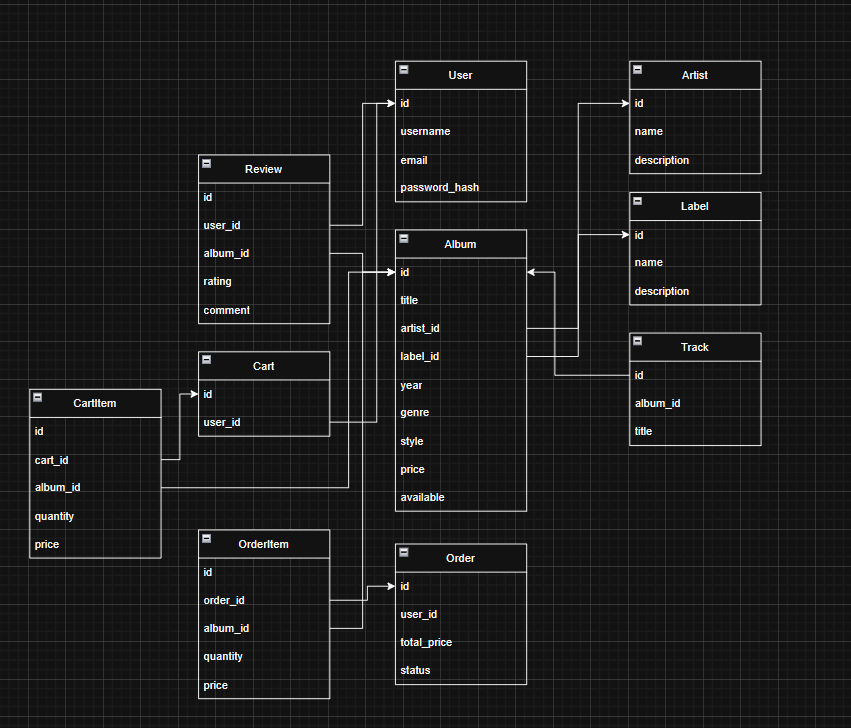

# vinyl-shop
### A website for selling vinyl records.
The main feature is a page with a list of albums, including a search field by title, artist, and genre. 

There should also be options to sort the results by price (lowest to highest, highest to lowest), popularity, genre, and release date.

Each album should have its own page with details such as: price, genre, style, available, label, release year, and a list of tracks. 

There should be a page with artists whose albums are available in the store. When navigating to an artist’s page, all their available albums should be displayed.

There should also be a page with record labels. On a label’s page, all albums released under that label should be shown.
It must be possible to add, edit, and delete data (albums, artists, labels).

Users should be able to register and log in.

### Authorized users should have a profile where they can:
- view their order history,
- edit their personal data,
- leave reviews and ratings for albums.

Users should also be able to add albums to their cart and then press “Buy” to create an order (simplified, without payment processing).

Finally, the site should include an “About Us” page with contact details, delivery information, and return policies.

---
# Endpoints description
## Albums

---
## ```GET /albums``` 
### list of albums with search & filtering

Query params:

- search (title/artist/genre)

- sort = price_asc | price_desc | popularity | genre | release_date_asc | release_date_desc

Response status: '200 OK' 

Example response body:
``` 
[
  { 
    "id": 1, 
    "title": "Blurryface", 
    "artist": "Twenty One Pilots", 
    "price": 35, 
    "genre": "Alternative Rock" 
  }
  ...
] 
```

Response status: '204 No Content'

Example response body:

``` 
[]
```
---
## ``` GET /albums/{id}```
### get details of a specific album

Response status: '200 OK'

Example response body:

```
{
  "id": 1,
  "title": "Blurryface",
  "artist": "Twenty One Pilots",
  "label": "Fueled by Ramen",
  "year": 2015,
  "genre": "Alternative Hip Hop",
  "style": "Electropop / Rap Rock",
  "price": 45,
  "available": true,
  "tracksIds": [1, 2, 3, 4, 5]
}
```

Response status: '404 Not Found' - if album doesn't exist.

---
## ``` GET /albums/{id}/tracks ```
### get names of tracks

Response status: '200 OK'

```
[
  { "id": 1, "title": "Heavydirtysoul" },
  { "id": 2, "title": "Stressed Out" }
]
```
---
## ``` POST /albums ``` 
### (admin) add a new album

Request body:

``` 
{
  "title": "Scaled and Icy",
  "artistId": 1,
  "labelId": 2,
  "year": 2021,
  "genre": "Alternative Rock",
  "style": "Pop Rock",
  "price": 50,
  "tracksIds": [1, 2, 3, 4]"]
}
```
Response status: '201 Created'

Response body:
```
{
  "id": 4,
  "title": "Scaled and Icy",
  "artistId": 1,
  "labelId": 2,
  "year": 2021,
  "genre": "Alternative Rock",
  "style": "Pop Rock",
  "price": 50,
  "available": true
}
```
---
## ``` PUT /albums/{id} ``` 
### (admin) update album data

Request body: same as POST

Response status: '200 OK'

---
## ``` DELETE /albums/{id} ``` 
### (admin) delete album

Response status: '204 No Content'

---
## Artists

---
## ``` GET /artists ``` 
### list of artists

Response status: '200 OK'

Example response body:
```
[ { "id": 1, "name": "Twenty One Pilots" } ]
```
---
## ``` GET /artists/{id}``` 
### get artist details with their albums

Response status: 200 OK

Example response body:
```
{
  "id": 1,
  "name": "Twenty One Pilots",
  "albums": [
    { "id": 1, "title": "Blurryface" },
    { "id": 2, "title": "Trench" },
    { "id": 3, "title": "Scaled and Icy" }
  ]
}


```
Response status: '404 Not Found' – artist does not exist

---
## ```POST /artists``` 
### (admin) add a new artist

Request body:
```
{ "name": "New Artist" }
```
Response status: '201 Created'

---
## ``` PUT /artists/{id} ``` 
### (admin) edit artist

Request body:
```
{ "name": "New Artist Name" }
```

Response status: '200 OK'

---
## ``` DELETE /artists/{id} ``` 
### (admin) delete artist

Response status: '204 No Content'

---
## Labels

---
## ``` GET /labels ``` 
### list of labels

Response status: '200 OK'

Example response body:
```
[ { "id": 2, "name": "Fueled by Ramen" } ]
```
---
## ```GET /labels/{id}``` 
### label details with albums

Response status: '200 OK'

Example response body:
```
{
  "id": 2,
  "name": "Fueled by Ramen",
  "albums": [
    { "id": 1, "title": "Blurryface" },
    { "id": 2, "title": "Trench" },
    { "id": 3, "title": "Scaled and Icy" }
  ]
}
```

Response status: '404 Not Found'

---
## ``` POST /labels ``` 
### (admin) add a new label

Request body:
```
{ "name": "Sony Music" }
```

Response status: '201 Created'

---
## ``` PUT /labels/{id} ``` 
### (admin) edit label

Request body: same as POST

Response status: '200 OK'

---
## ``` DELETE /labels/{id} ``` 
### (admin) delete label

Response status: '204 No Content'

---
## Authentication & Users

---
## ```POST /auth/register``` 
### register a new user

Request body:
```
{
  "username": "fan123",
  "email": "fan@example.com",
  "password": "securePass"
}
```

Response status: '201 Created'

Response status: '400 Bad Request' – invalid input

---
## ``` POST /auth/login ```
### user login

Request body:
```
{
  "email": "fan@example.com",
  "password": "securePass"
}
```

Response status: '200 OK'

Response status: '401 Unauthorized' - wrong credentials

---
## ```GET /users/me``` 
### get current user profile

Response status: '200 OK'

Example response body:
``` 
{
  "id": 1,
  "username": "fan123",
  "email": "fan@example.com",
  "orders": [...],
  "reviews": [...]
}
```

---
## ``` PUT /users/me ``` 
### update profile data

Request body:
```
{ "username": "newFanName", "email": "newfan@example.com" }
```

Response status: '200 OK'

---
## Reviews

---
## ``` POST /albums/{id}/reviews ``` 
### (authorized) add a review for an album

Request body:
```
{ "rating": 5, "comment": "Blurryface is iconic!" }
```

Response status: '201 Created'

---
## ```GET /albums/{id}/reviews``` 
### get reviews for an album

Response status: '200 OK'
Example response body: 
```
[
  { "user": "fan123", "rating": 5, "comment": "Blurryface is iconic!" },
  { "user": "musiclover", "rating": 4, "comment": "Trench is amazing!" }
]
```

---
## Cart & Orders

---
## ```POST /carts/{id}/albums``` 
### (authorized) add album to cart

Request body:
```
{ "albumId": 1, "quantity": 1 }
```

Response status: '200 OK'

---
## ```GET /carts/{id}/albums``` 
### (authorized) view cart

Response status: '200 OK'

Example response body:
```
[
  { "albumId": 1, "title": "Blurryface", "price": 45, "quantity": 1 },
  { "albumId": 2, "title": "Trench", "price": 50, "quantity": 2 }
]
```

---
## ``` DELETE /carts/{id}/albums/{albumId}``` 
### (authorized) remove album from cart

Response status: '204 No Content'

---
## ```POST /orders``` 
### (authorized) create order from cart

Response status: '201 Created'

## ```GET /orders``` 
### (authorized) view order history

Response status: '200 OK'

---
## About

---
## ```GET /about``` 
### about the shop (contacts, delivery, returns)

Response status: '200 OK'

Example response body:
```
{
  "contacts": "email: shop@vinyl.com",
  "delivery": "2-5 days worldwide",
  "returns": "14 days policy"
}
```


